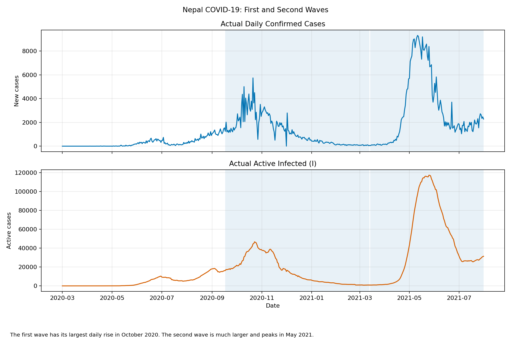
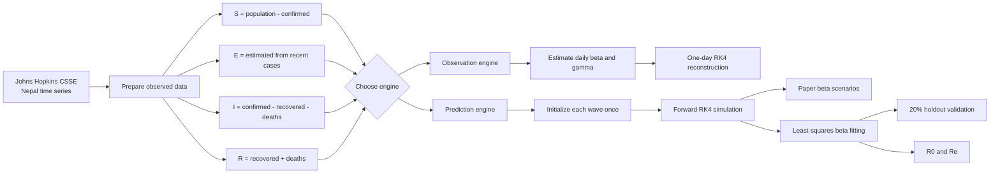
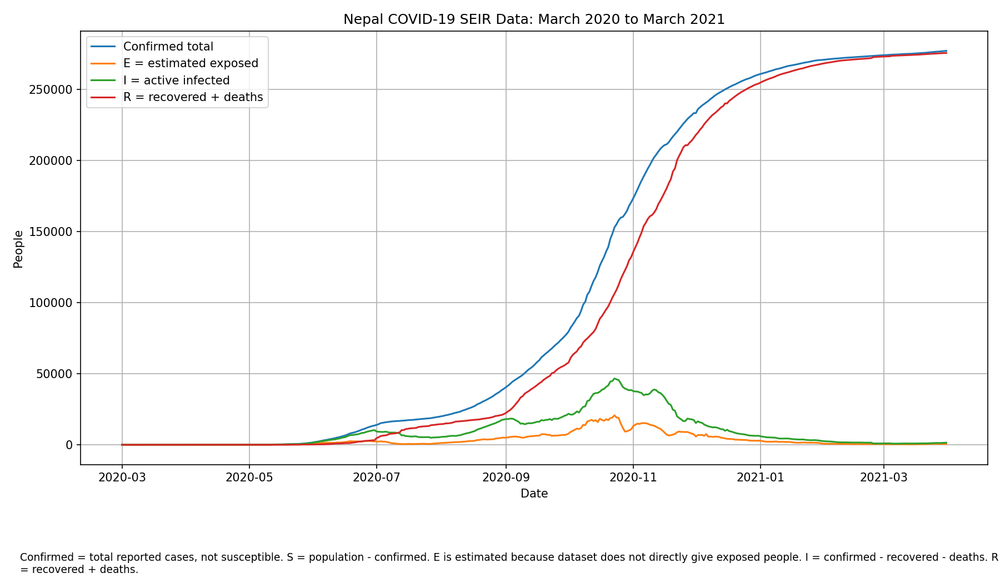
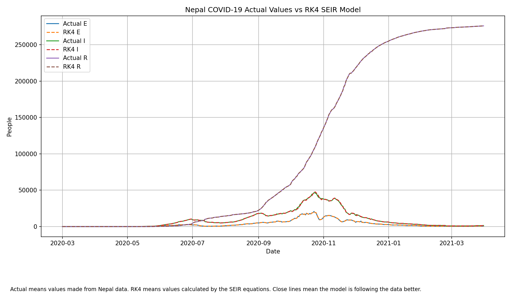
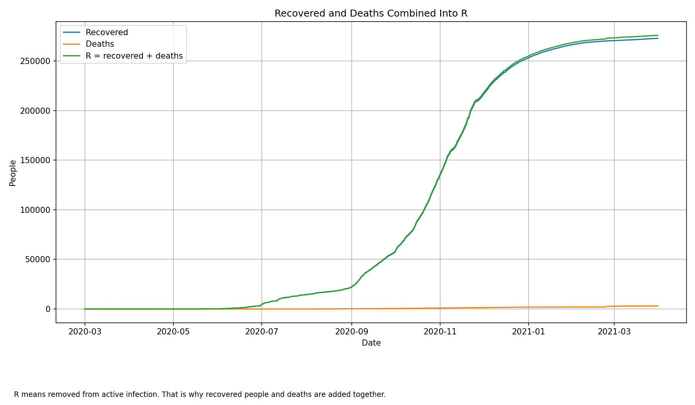
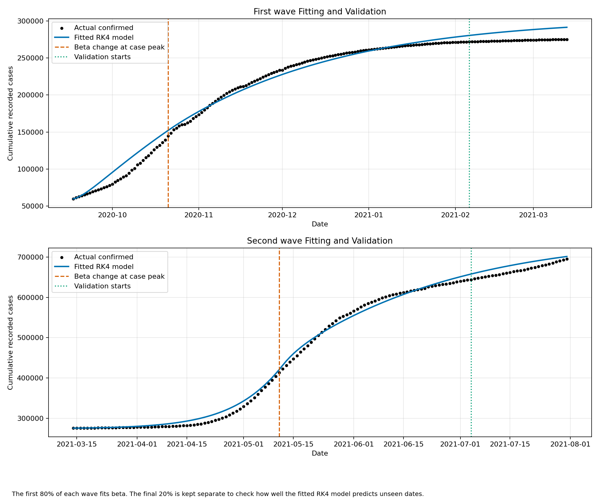
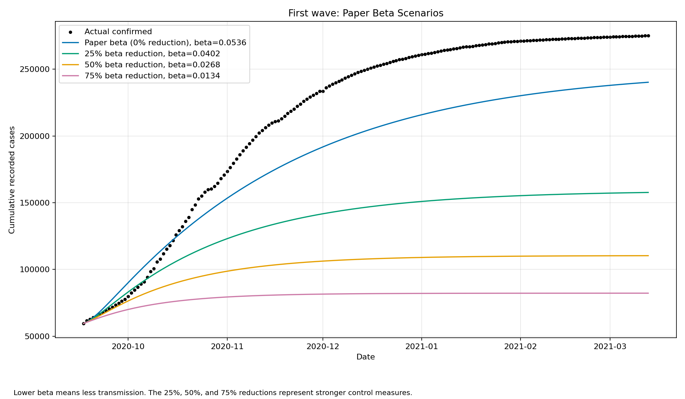
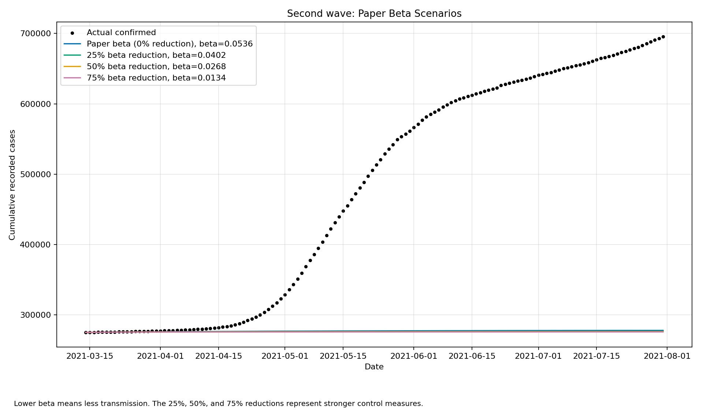
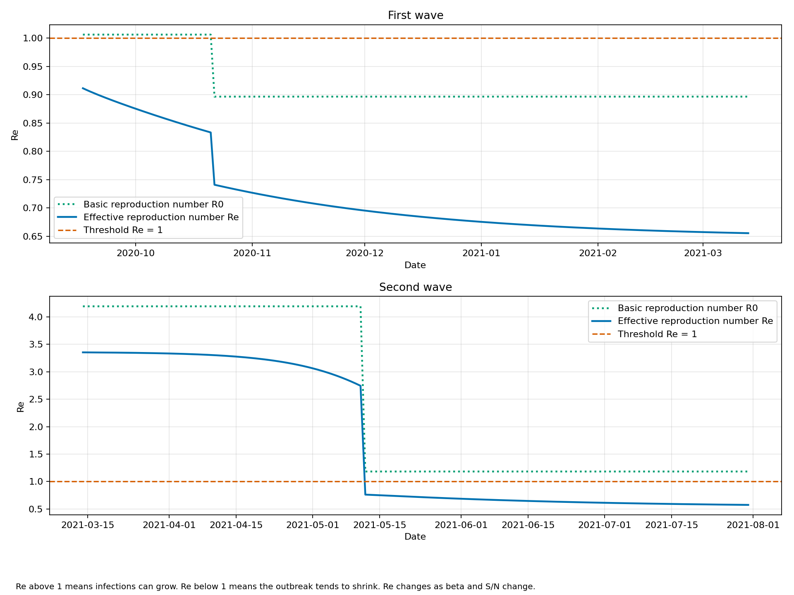
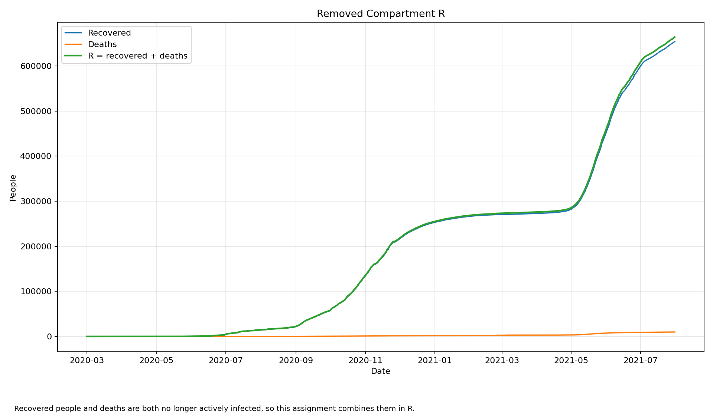

<div align="center">

# Nepal COVID-19 SEIR Laboratory

### One dataset. Two modeling philosophies. Nine visual proofs.

<p>
  
  
  
  
</p>

<p>
  
  
  
  
  
</p>

<p>
  <strong>Observed Nepal data enters from one side. Mathematical assumptions enter from the other.<br>
  The repository makes them meet in the middle and measures what survives.</strong>
</p>

</div>

<p align="center">
  
</p>

---

## The Experiment Console

```text
+------------------------------------------------------------------------------+
|                         NEPAL SEIR LABORATORY                                |
+--------------------------------------+---------------------------------------+
| OBSERVATION ENGINE                   | PREDICTION ENGINE                     |
|                                      |                                       |
| Actual data every day                | One initial state per wave            |
| Daily beta and gamma estimates       | Paper parameters and fitted beta      |
| One-day RK4 reconstruction           | Full forward RK4 simulation           |
| March 2020 to March 2021             | First wave and second wave            |
|                                      |                                       |
| Question: Can SEIR explain today     | Question: Can SEIR predict tomorrow   |
| when yesterday is already known?     | without receiving actual data again?  |
+--------------------------------------+---------------------------------------+
| SHARED CORE: Nepal data + S E I R + recovered and deaths in R + RK4         |
+------------------------------------------------------------------------------+
```

This is not one model presented twice. It is a controlled comparison between
two different ways of using the same SEIR idea.

## Two Engines, Two Questions

| | Observation engine | Prediction engine |
|---|---|---|
| Main file | [`nepal_covid_rk4.py`](nepal_covid_rk4_project/nepal_covid_rk4.py) | [`nepal_two_wave_paper_rk4.py`](nepal_covid_rk4_project/paper_two_wave_analysis/nepal_two_wave_paper_rk4.py) |
| Starting point | Previous day's actual state | One initial state for the complete wave |
| Parameter style | Daily beta and gamma estimated from data | Paper parameters with fitted before-peak and after-peak beta |
| RK4 use | Reconstruct one next day | Predict every succeeding day |
| Data period | 1 March 2020 to 31 March 2021 | Wave 1: 17 September 2020 to 13 March 2021<br>Wave 2: 14 March 2021 to 31 July 2021 |
| Validation | Visual comparison | First 80% fitting, final 20% validation |
| Main output | Actual compartments versus calculated compartments | Scenarios, fitted curves, `R0`, `Re`, and validation metrics |
| Best interpretation | Data-based SEIR reconstruction | Paper-based forward wave experiment |

## The Full Signal Path



## Compartment Board

| Symbol | Meaning in this repository | Construction |
|---|---|---|
| `S` | People still susceptible | `population - confirmed` in observed data |
| `E` | Infected but not yet infectious | Estimated because JHU does not report exposed people |
| `I` | Active infectious cases | `confirmed - recovered - deaths` |
| `R` | Removed from active infection | `recovered + deaths` |

The paper-based model follows:

$$
\frac{dS}{dt} = -\frac{\beta SI}{N}
$$

$$
\frac{dE}{dt} = \frac{\beta SI}{N} - \eta E
$$

$$
\frac{dI}{dt} = \eta E - (\gamma + \delta)I
$$

$$
\frac{dR}{dt} = (\gamma + \delta)I
$$

Recorded cumulative cases are connected to the hidden exposed population by:

$$
\frac{dL}{dt} = p\eta E
$$

## RK4 Core

For every simulated day, both programs use the fourth-order Runge-Kutta rule:

$$
y_{n+1}=y_n+\frac{h}{6}(k_1+2k_2+2k_3+k_4)
$$

The critical difference is where `y_n` comes from:

```text
Observation engine: y_n comes from the actual data again each day.
Prediction engine:  y_n comes only from the previous model prediction.
```

That single distinction changes the work from reconstruction into forward
simulation.

## Paper Parameter Matrix

The prediction engine uses values from *Transmission Dynamics of COVID-19 in
Nepal* by Khagendra Adhikari, Dhan Bahadur Shrestha, Ramesh Gautam, and Anjana
Pokharel.

| Parameter | Meaning | Paper value |
|---|---|---:|
| `beta` | Transmission rate | `0.0536/day` |
| `eta` | Exposed to infectious rate | `0.192/day` |
| `gamma` | Recovery rate | `0.0588/day` |
| `delta` | Disease mortality rate | `0.004/day` |
| `p` | Recorded portion | `0.0473` |

The paper includes natural mortality `mu` but does not provide its numerical
value. This project uses `mu = 0` for the short epidemic periods rather than
inventing an unsupported value.

### Transmission control scenarios

| Experiment | Beta |
|---|---:|
| Paper baseline | `0.0536` |
| 25% reduction | `0.0402` |
| 50% reduction | `0.0268` |
| 75% reduction | `0.0134` |

## Result Ledger

| Result | First wave | Second wave |
|---|---:|---:|
| Highest daily confirmed cases | `5,743` | `9,317` |
| Peak date | `2020-10-21` | `2021-05-11` |
| Fitted beta before peak | `0.0632` | `0.2631` |
| Fitted beta after peak | `0.0563` | `0.0743` |
| Basic `R0` before peak | `1.0061` | `4.1899` |
| Basic `R0` after peak | `0.8966` | `1.1832` |
| Validation MAPE | `4.68%` | `2.14%` |

### What the numbers say

1. The second wave required a fitted pre-peak beta more than four times the
   first-wave value.
2. The paper beta `0.0536` gives `R0 = 0.8535` under the implemented paper
   formula.
3. That paper beta represents a controlled or declining period, but it cannot
   reproduce the rapid growth of Nepal's second wave.
4. Fitted beta falls after both case peaks.
5. Every 25%, 50%, and 75% beta reduction produces fewer predicted cases.
6. The effective reproduction number falls below one after the second-wave
   beta change because both transmission and the susceptible fraction decrease.

## Model Fitting and Validation Chamber

The prediction engine does not fit and evaluate on the same dates.

```text
Wave timeline

|<------------------------ 80% fitting ------------------------>|<-- 20% test -->|
|         beta before peak         |       beta after peak      |   untouched    |
```

SciPy least squares selects two beta values by minimizing:

$$
J(\phi)=\sum_{k=1}^{n}\left(L_{\text{model}}(t_k)-L_{\text{actual}}(t_k)\right)^2
$$

The final 20% is held back and measured with RMSE, MAE, MAPE, and
`R-squared`. This makes the validation section a real prediction check, not
just a curve drawn over data used during fitting.

## Complete Plot Atlas

Every generated image in the repository appears below.

### Observation engine

<table>
  <tr>
    <td width="50%" align="center">
      <strong>Observed SEIR compartments</strong><br><br>
      
    </td>
    <td width="50%" align="center">
      <strong>Actual values versus one-day RK4</strong><br><br>
      
    </td>
  </tr>
  <tr>
    <td colspan="2" align="center">
      <strong>Recovered and deaths combined into R</strong><br><br>
      
    </td>
  </tr>
</table>

### Prediction engine

<table>
  <tr>
    <td width="50%" align="center">
      <strong>Both observed waves</strong><br><br>
      
    </td>
    <td width="50%" align="center">
      <strong>Model fitting and holdout validation</strong><br><br>
      
    </td>
  </tr>
  <tr>
    <td width="50%" align="center">
      <strong>First-wave beta experiments</strong><br><br>
      
    </td>
    <td width="50%" align="center">
      <strong>Second-wave beta experiments</strong><br><br>
      
    </td>
  </tr>
  <tr>
    <td width="50%" align="center">
      <strong>Basic and effective reproduction numbers</strong><br><br>
      
    </td>
    <td width="50%" align="center">
      <strong>Removed compartment across both waves</strong><br><br>
      
    </td>
  </tr>
</table>

## Reproduce the Laboratory

### 1. Clone this repository

```bash
git clone https://github.com/AashishThakuri/Covid-19-SEIR-Model.git
cd Covid-19-SEIR-Model
```

### 2. Add the Johns Hopkins dataset

```bash
git clone https://github.com/CSSEGISandData/COVID-19.git COVID-19
```

Expected structure:

```text
Covid-19-SEIR-Model/
|-- COVID-19/
|-- nepal_covid_rk4_project/
|   |-- nepal_covid_rk4.py
|   |-- data/
|   |-- outputs/
|   |-- plots/
|   `-- paper_two_wave_analysis/
|       |-- nepal_two_wave_paper_rk4.py
|       |-- data/
|       |-- outputs/
|       `-- plots/
`-- README.md
```

### 3. Run the observation engine

```bash
python -m pip install -r nepal_covid_rk4_project/requirements.txt
python nepal_covid_rk4_project/nepal_covid_rk4.py
```

### 4. Run the prediction engine

```bash
python -m pip install -r nepal_covid_rk4_project/paper_two_wave_analysis/requirements.txt
python nepal_covid_rk4_project/paper_two_wave_analysis/nepal_two_wave_paper_rk4.py
```

Both programs save their CSV files and plots inside their own folders. The
prediction engine does not overwrite the observation engine.

## Output Contracts

<details>
<summary><strong>Observation engine outputs</strong></summary>

| Output | Purpose |
|---|---|
| `data/nepal_covid_mar2020_mar2021.csv` | Prepared Nepal S, E, I, and R data |
| `outputs/nepal_daily_seir_parameters.csv` | Daily estimated beta, sigma, and gamma |
| `outputs/nepal_seir_rk4_simulation.csv` | Actual and reconstructed values |
| `outputs/summary.json` | Findings from the data and plots |

</details>

<details>
<summary><strong>Prediction engine outputs</strong></summary>

| Output | Purpose |
|---|---|
| `data/nepal_covid_two_waves.csv` | Prepared data for both waves |
| `outputs/paper_beta_scenarios_both_waves.csv` | Four paper beta experiments for each wave |
| `outputs/rk4_model_fitting_validation.csv` | Actual values, predictions, beta, `R0`, and `Re` |
| `outputs/model_validation_metrics.csv` | RMSE, MAE, MAPE, and `R-squared` |
| `outputs/model_parameters.csv` | Paper and fitted parameter values |
| `outputs/summary.json` | Complete numerical findings and conclusions |

</details>

## Scientific Honesty Panel

This repository makes its assumptions visible:

- `E` is estimated because exposed cases are not directly reported by JHU.
- The observation engine is a reconstruction, not an independent forecast.
- The paper gives first-wave initial values but not second-wave initial values.
- Second-wave hidden initial states are estimated using the paper's recorded
  portion `p`.
- Natural mortality is set to zero because the paper does not provide its
  numerical value.
- A two-beta SEIR model cannot represent every intervention, reporting delay,
  variant, vaccination effect, or behavior change.
- A close curve is evidence of fit, not proof that every hidden compartment is
  known exactly.

## Documentation

| Document | Contents |
|---|---|
| [Original model guide](nepal_covid_rk4_project/DOCUMENTATION.md) | Simple explanation of the observation engine |
| [Prediction model documentation](nepal_covid_rk4_project/paper_two_wave_analysis/DOCUMENTATION.md) | Equations, fitting, validation, and interpretation |
| [Code explanation](nepal_covid_rk4_project/paper_two_wave_analysis/CODE_EXPLANATION.md) | Plain-language explanation of the prediction code |
| [Prediction summary](nepal_covid_rk4_project/paper_two_wave_analysis/outputs/summary.json) | Machine-readable findings |

---

<div align="center">

### Built as a transparent numerical experiment

Data is observed. Compartments are constructed. Parameters are declared.
Predictions are tested. Errors remain visible.

**Author: [Aashish Thakuri](https://github.com/AashishThakuri)**

</div>
